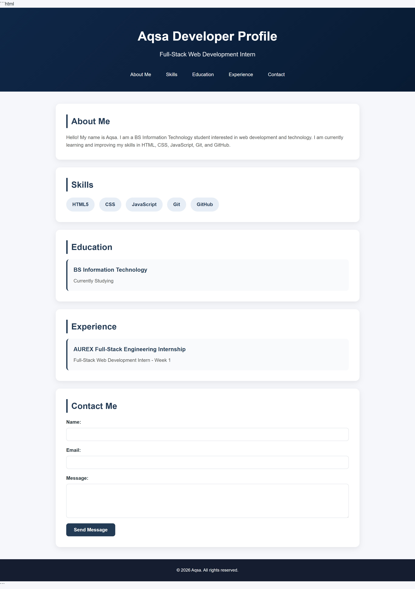
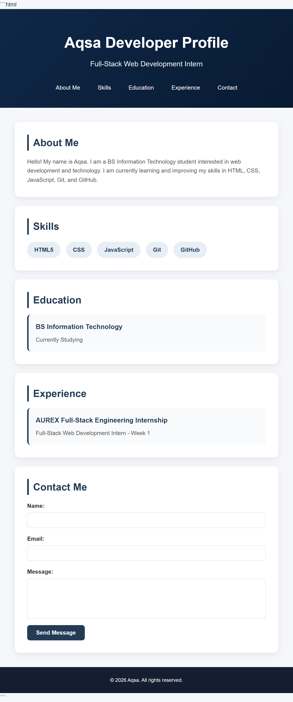
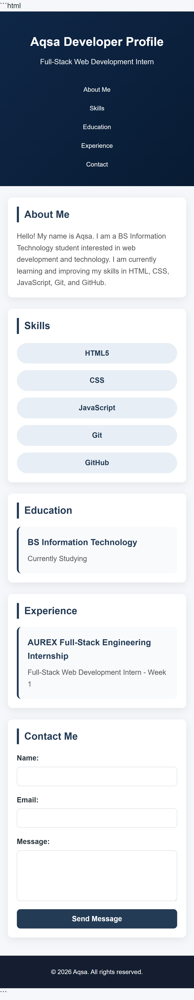
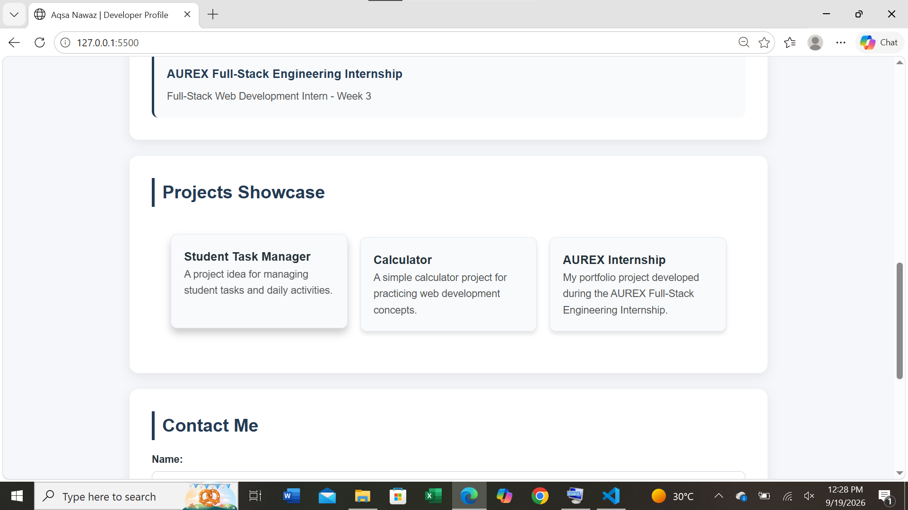
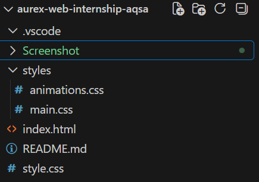

# AUREX Full-Stack Engineering Internship - Modern Web Application

**Intern Name:** Aqsa Nawaz
**Domain:** Full-Stack Web Development
**Current Progress:** Week 3 Completed
**Live Deployment:** [View Live Application](https://your-github-username.github.io/aurex-web-internship-aqsa/)

---

## 📌 Project Overview
This repository contains the progressive deliverables for the AUREX Full-Stack Engineering Internship. Starting from basic HTML structure in Week 1 and layout concepts in Week 2, this Week 3 phase enhances the application into an interactive showcase page using advanced CSS Grid, modern Flexbox structures, clean micro-interactions, and visual animations.

---

## 🗓️ Weekly Progress Summary

### 🔹 Week 1 & Week 2: Foundations & Layouts
- Setup basic semantic HTML5 structure and clean repository workflow.
- Applied CSS reset, typography, and initial layout styling for developer portfolio sections.

### 🔹 Week 3: Advanced CSS, CSS Grid, Flexbox & Micro-Interactions
- **CSS Architecture:** Separated styling concerns into modular files (`styles/main.css` and `styles/animations.css`).
- **Responsive CSS Grid:** Designed dynamic project gallery using `grid-template-columns: repeat(auto-fit, minmax(280px, 1fr))` for fluid element wrapping across viewports.
- **Micro-Interactions & Animations:** Created custom `@keyframes fadeIn` page load transitions, smooth button feedback, and card hover elevations (`transform: translateY(-8px)`).
- **Mobile-First Responsiveness:** Guaranteed zero horizontal scrollbars with complete fluid scalability.

---

## 📱 Visual Proofs & Device Testing Outcomes

| Desktop View | Tablet View | Mobile View |
| :---: | :---: | :---: |
|  |  |  |

### 🔍 Micro-Interactions & Project Structure

- **Card Hover State Elevation:**
  
  **Clean Repository Architecture:**
  

---

## 🚀 Progress Reflection
In Week 3, combining CSS Grid (`auto-fit`/`minmax`) with Flexbox made building responsive components effortless without relying excessively on rigid media queries. Splitting animations into `styles/animations.css` significantly improved code organization and maintainability.