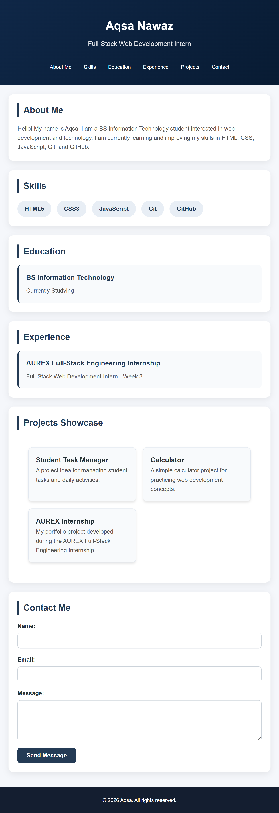
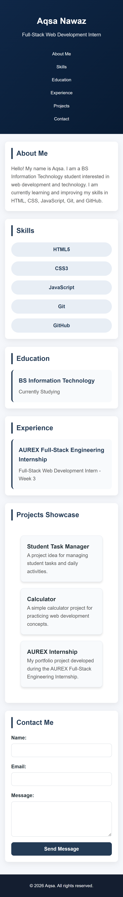

# AUREX Full-Stack Engineering Internship - Week 3

**Intern Name:** Aqsa Nawaz
**Domain:** Full-Stack Web Development
**Week:** Week 3 (Advanced CSS, CSS Grid, Flexbox & Micro-Interactions)
**Live Deployment:** [View Live Web Application](https://your-github-username.github.io/aurex-web-internship-aqsa/)

---

## 📌 Project Overview
This project represents the Week 3 deliverable for the AUREX Full-Stack Engineering Internship. It features an interactive, modern web application page built using clean CSS architecture, custom animations, fluid typography, and complex layouts.

---

## 🛠️ Features & Implementations

### 1. Advanced CSS Grid & Flexbox Architecture
- Implemented responsive multi-column gallery layout using `grid-template-columns: repeat(auto-fit, minmax(280px, 1fr))` to naturally adjust layout across devices.
- Utilized Flexbox for inner card content alignment, action buttons, and vertical centering.
- Structured CSS into maintainable components with modular setup:
  - `styles/main.css`: Base layouts, variables, typography, and Grid/Flexbox structures.
  - `styles/animations.css`: Dynamic micro-interactions and custom keyframe animations.

### 2. Animations & Micro-Interactions
- Custom `@keyframes fadeIn` animations for smooth page load transitions.
- Interactive card hover state elevations (`transform: translateY(-8px)`) with subtle box-shadow depth.
- Smooth CSS transition effects (`transition: transform 0.3s ease, box-shadow 0.3s ease`).

### 3. Responsive Design & Modern UI/UX
- Mobile-first approach guaranteeing zero horizontal scrollbars across mobile, tablet, and desktop viewports.
- Custom CSS Variables (`:root`) for color palettes and typographic scaling.

---

## 📱 Performance & Visual Proofs

| Desktop View | Tablet View | Mobile View |
| :---: | :---: | :---: |
|  |  |  |

### Micro-Interactions & Structure
- **Hover State Elevation:**
  
- **Clean Repository Architecture:**
  

---

## 🚀 Weekly Reflection
During Week 3, I deepened my knowledge of modern CSS layout techniques by combining CSS Grid (`auto-fit`/`minmax`) with Flexbox to create scalable UI structures without relying heavily on rigid media queries. Separating concerns into `main.css` and `animations.css` significantly improved code cleanliness and maintainability.